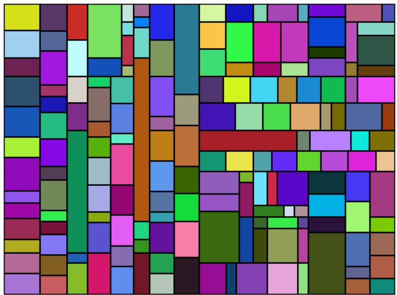

# Mondrian Tiles

`Mondrian Tiles` is a type of art-inspired design that is characterized by its use of rectangular shapes in primary
colors (red, blue, and yellow) and non-primary colors (white, black, and gray). It is named after the Dutch painter Piet
Mondrian, who is known for his abstract paintings that feature a similar style.

`Mondrian Tiles` are often used in graphic design, interior design, and web design to create a clean, modern aesthetic.
The design is created by dividing a space into a grid of rectangles and filling each rectangle with a color or
combination of colors. The rectangles can be arranged in different ways to create different compositions, but they
always maintain the same basic principles of using primary colors and rectangular shapes.

`Mondrian Tiles` are a popular design choice because they are simple, bold, and visually striking. They can be used to
create a wide range of designs, from minimalist to more complex and layered compositions.

In this repository, `Mondrian Tiles` is solved in two ways, one using **recursive** and the other using a *
*non-recursive**
approach. In this project, you can create a tile pattern inspired by Piet Mondrian's artwork. You can choose the number
of tiles, the colors, and the tile's size.