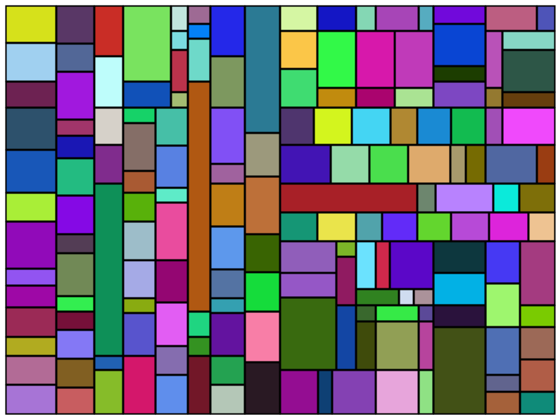
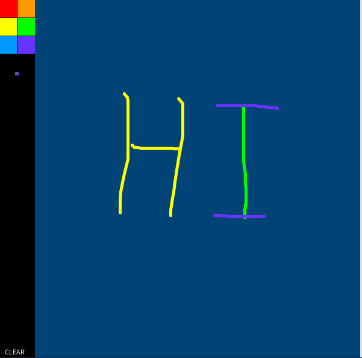

<div align="center">
  <h1>Processing Art</h1>
  <br />
  <a href="#getting-started"><strong>Getting Started »</strong></a>
  <br />
  <br />
  <a href="https://github.com/HamidMolareza/processing-art/issues/new?assignees=&labels=bug&template=BUG_REPORT.md&title=bug%3A+">Report a Bug</a>
  ·
  <a href="https://github.com/HamidMolareza/processing-art/issues/new?assignees=&labels=enhancement&template=FEATURE_REQUEST.md&title=feat%3A+">Request a Feature</a>
  .
  <a href="https://github.com/HamidMolareza/processing-art/issues/new?assignees=&labels=question&template=SUPPORT_QUESTION.md&title=support%3A+">Ask a Question</a>
</div>

<div align="center">
<br />


[](https://github.com/HamidMolareza/processing-art/issues?q=is%3Aissue+is%3Aopen+label%3A%22help+wanted%22)
[](https://github.com/HamidMolareza)

</div>

## About

This repository contains some **personal** practice and art projects with [Processing](https://processing.org/), which
is a flexible software sketchbook and a language for learning how to code within the context of the visual arts. All the
projects in this repository are written with **Python** using the Processing Python mode.

### Built With

- [Processing](https://processing.org/) - a flexible software sketchbook and a language for learning how to code within
  the context of the visual arts
- [Python](https://www.python.org/) - a programming language that is easy to learn and has a clear syntax
- [Processing Python mode](https://py.processing.org/) - a Python environment for the Processing Development
  Environment (PDE)

## Getting Started

### Prerequisites

Before running the projects in this repository, you will need to install the Processing Python mode. You can download
the Processing IDE [here](https://processing.org/download/) and install the Python mode from the PDE's "Tools" menu.

### Clone

To get started, clone the repository or download the ZIP file.

```bash
git clone https://github.com/HamidMolareza/processing-art.git
```

### Run

To run the projects, navigate to the directory of the project you want to run, and run the corresponding Python file
using the Processing Python mode.

For example, to run the `Mondrian Tiles` project, navigate to the `MondrianTiles` directory and copy the solution to
Processing IDE and run it.

## Projects

### Mondrian Tiles



`Mondrian Tiles` is a type of art-inspired design that is characterized by its use of rectangular shapes in primary
colors (red, blue, and yellow) and non-primary colors (white, black, and gray). It is named after the Dutch painter Piet
Mondrian, who is known for his abstract paintings that feature a similar style.

`Mondrian Tiles` are often used in graphic design, interior design, and web design to create a clean, modern aesthetic.
The design is created by dividing a space into a grid of rectangles and filling each rectangle with a color or
combination of colors. The rectangles can be arranged in different ways to create different compositions, but they
always maintain the same basic principles of using primary colors and rectangular shapes.

`Mondrian Tiles` are a popular design choice because they are simple, bold, and visually striking. They can be used to
create a wide range of designs, from minimalist to more complex and layered compositions.

In this repository, `Mondrian Tiles` is solved in two ways, one using **recursive** and the other using a *
*non-recursive**
approach. In this project, you can create a tile pattern inspired by Piet Mondrian's artwork. You can choose the number
of tiles, the colors, and the tile's size.

### Simple Paint Program



The Simple Paint Program allows the user to choose a color from the color panel and draw on the screen. The user can
also change the brush size and erase the drawing.

## Support

Reach out to the maintainer at one of the following places:

- [GitHub issues](https://github.com/HamidMolareza/processing-art/issues/new?assignees=&labels=question&template=SUPPORT_QUESTION.md&title=support%3A+)

# FAQ

## What is Processing?

[Processing](https://processing.org/) is a flexible software sketchbook and a language for learning how to code within
the context of the visual
arts. It is an open-source project that promotes software literacy within the visual arts and visual literacy within
technology.

## What is the Processing Python mode?

The Processing Python mode is a Python environment for the Processing Development Environment (PDE). It allows Python
programmers to take advantage of the Processing visualization libraries and tools to create graphical applications and
interactive artwork.

## Can I contribute to this repository?

Yes! Contributions to this repository are welcome. If you have any suggestions or want to add your own projects, feel
free to create a pull request.

## What license is this repository under?

This repository is licensed under the GPLv3 license. See the [LICENSE](LICENSE) file for more details.

## Contributing

First off, thanks for taking the time to contribute! Contributions are what make the free/open-source community such an
amazing place to learn, inspire, and create. Any contributions you make will benefit everybody else and are **greatly
appreciated**.

Please read [our contribution guidelines](docs/CONTRIBUTING.md), and thank you for being involved!

## Authors & contributors

- The original setup of this repository is by [HamidMolareza](https://github.com/HamidMolareza).
- [Mohammad Ali Rastegar](github.com/mohras148/)
- For a full list of all authors and contributors,
  see [the contributors page](https://github.com/HamidMolareza/processing-art/contributors).

## License

This project is licensed under the **GPLv3**.

See [LICENSE](LICENSE) for more information.

## Acknowledgements

- Thanks to my very good friend, Mr. [Mohammad Ali Rastegar](github.com/mohras148/), I got acquainted with this field.
  Unlike him, I did not work professionally in this field and probably will not. If you need more help and guidance, it
  is better to talk to him.

- The initial idea for solving the `Mondrian Tiles` problem was taken from [this repository](https://github.com/erdavids/Mondrian-Tiles) and improved.

## Related

Here are some related resources and projects that you may find interesting:

- [Processing.org](https://processing.org/) - the official website of Processing
- [Processing.py](https://py.processing.org/) - the official Python mode for Processing
- [Processing Foundation](https://processingfoundation.org/) - a nonprofit organization dedicated to promoting software
  literacy within the visual arts and visual literacy within technology
- [OpenProcessing](https://www.openprocessing.org/) - an online community platform for sharing Processing sketches and
  projects